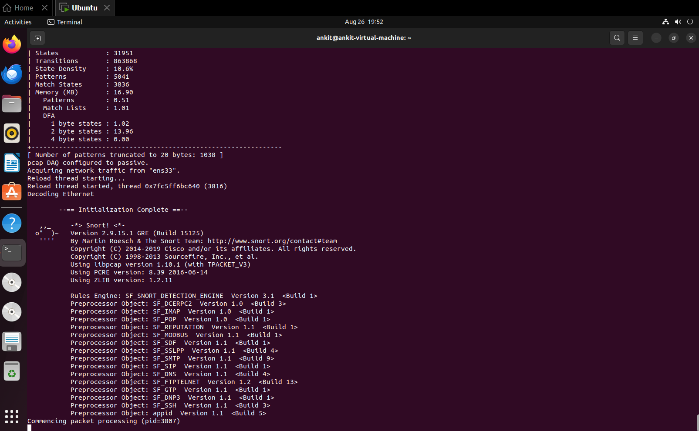
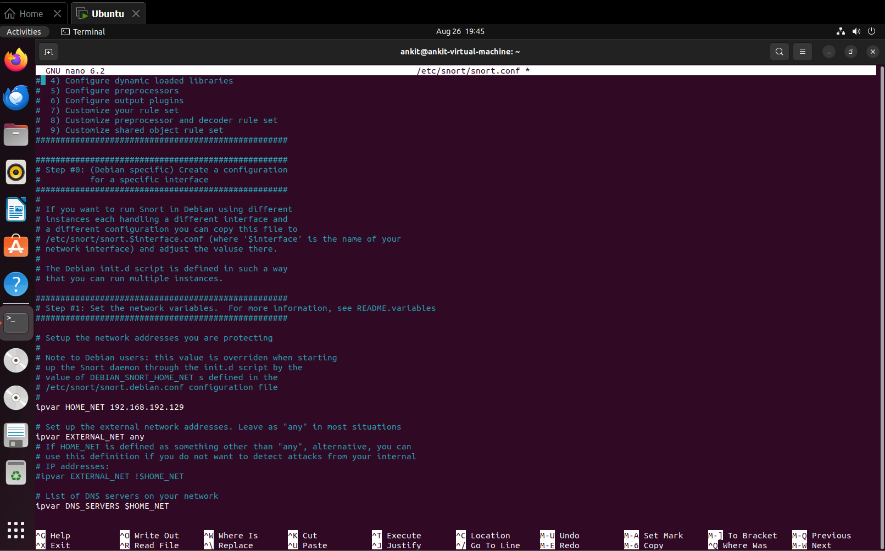
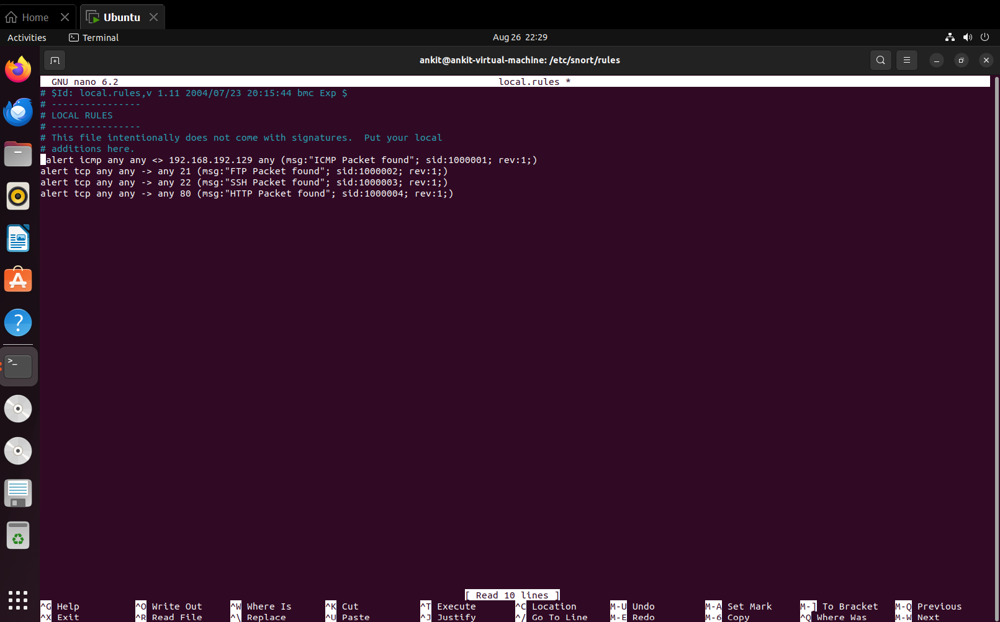
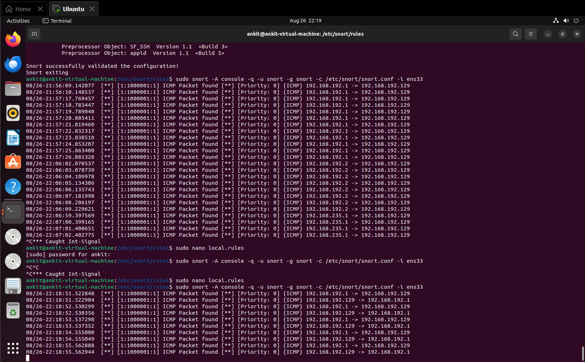
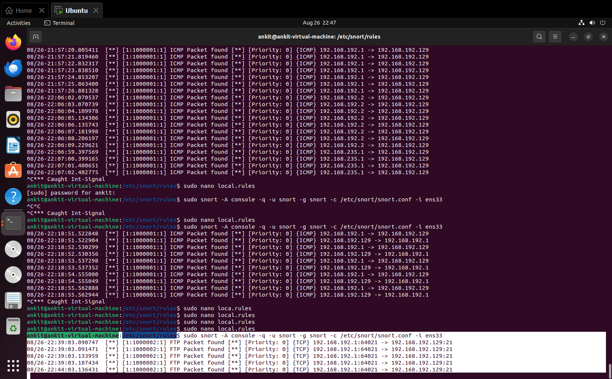
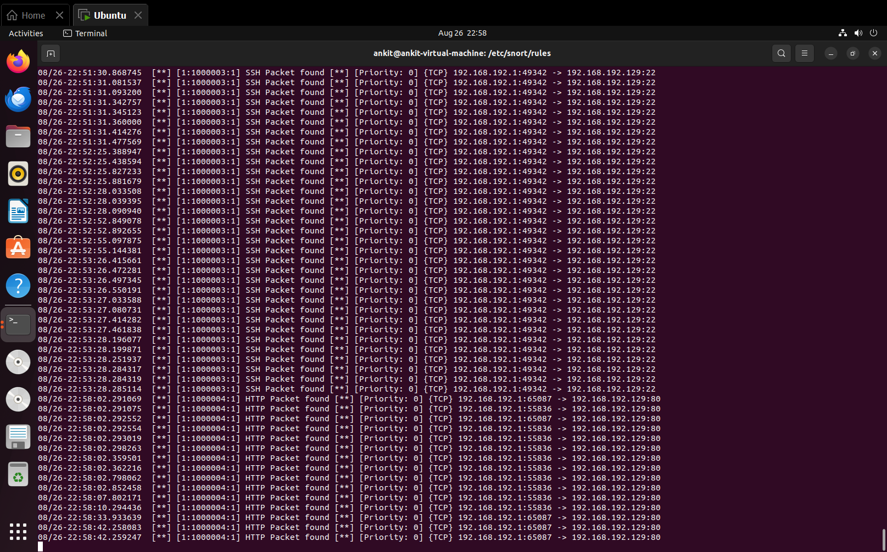

# Snort IDS Lab

A hands-on Intrusion Detection System (IDS) lab using Snort to detect and monitor network traffic in a controlled virtualized environment.

## Project Overview

This project demonstrates how Snort can be configured with custom detection rules to generate alerts for different types of network traffic.

The lab uses Ubuntu as the Snort IDS system and Windows as the testing machine.

## Lab Environment

| Component | Details |
|---|---|
| IDS | Snort 2.9.15.1 |
| IDS OS | Ubuntu 22.04.5 LTS |
| Testing OS | Windows |
| Network Interface | ens33 |
| Ubuntu IP | 192.168.192.129 |
| Windows IP | 192.168.192.1 |
| Detection Type | Network traffic monitoring |

## Detection Rules

The project contains custom Snort rules for:

- ICMP
- FTP
- SSH
- HTTP

### Custom Rules

```text
alert icmp any any <> 192.168.192.129 any (msg:"ICMP Packet found"; sid:1000001; rev:1;)
alert tcp any any -> any 21 (msg:"FTP Packet found"; sid:1000002; rev:1;)
alert tcp any any -> any 22 (msg:"SSH Packet found"; sid:1000003; rev:1;)
alert tcp any any -> any 80 (msg:"HTTP Packet found"; sid:1000004; rev:1;)
```

## Snort Configuration

The Snort configuration was tested using:

```bash
sudo snort -T -c /etc/snort/snort.conf
```

The configuration was successfully validated.

Snort was then started in console alert mode:

```bash
sudo snort -A console -q -u snort -g snort -c /etc/snort/snort.conf -i ens33
```

## Testing

Network traffic was generated from the Windows testing machine to the Ubuntu Snort machine.

### ICMP Test

```text
ping 192.168.192.129
```

Snort detected the ICMP traffic and generated an alert.

### FTP Test

```text
ftp 192.168.192.129
```

Snort detected traffic to TCP port 21 and generated an FTP alert.

### SSH Test

```text
ssh ankit@192.168.192.129
```

Snort detected traffic to TCP port 22 and generated an SSH alert.

### HTTP Test

HTTP traffic was generated toward TCP port 80.

Snort detected the traffic and generated an HTTP alert.

## Evidence

The following screenshots demonstrate the installation, configuration, custom rules, and IDS alerts.

### 1. Snort Installation



### 2. Snort Configuration



### 3. Custom Local Rules



### 4. ICMP Alert



### 5. FTP Alert



### 6. SSH Alert



### 7. HTTP Alert


## Project Structure

```text
snort-ids-lab/
├── README.md
├── LICENSE
├── rules/
│   └── local.rules
├── reports/
│   ├── local.rules
│   └── snort.conf
├── screenshots/
├── evidence/
├── logs/
└── docs/
```

## Learning Objectives

- Understand IDS concepts
- Install and configure Snort
- Create custom Snort rules
- Monitor network traffic
- Detect ICMP traffic
- Detect FTP traffic
- Detect SSH traffic
- Detect HTTP traffic
- Analyze IDS alerts
- Practice network security monitoring in a controlled lab

## Conclusion

This lab demonstrates a basic Snort-based IDS environment using Ubuntu and Windows virtual machines. Custom detection rules were created and successfully tested against ICMP, FTP, SSH, and HTTP traffic.

## Disclaimer

This project is intended for educational purposes and authorized laboratory environments only.

Do not use these techniques to monitor or test networks without proper authorization.

## License

This project is licensed under the MIT License.
